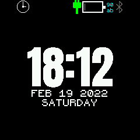
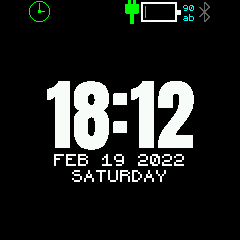
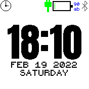
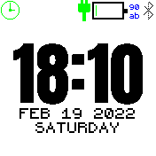

# GPS Time Widget

This widget synchronizes the local time with the GPS time.

The idea is derived from [GPS auto time](https://banglejs.com/apps/#gpsautotime) but has nothing in common with it except the logo.

## Functionality
Every 4 hours the widget activates GPS and waits for the time from GPS (usually 2-3 seconds, no fix is needed).

When it gets the time, it checks the difference with the local time. If it is greater than 2 seconds, the local time is updated. 

If no time is received via GPS within 10 seconds, the GPS is deactivated again. A new attempt starts after 4 hours.

With the start of the time search the widget shows a small clock. 

When the time is successfully received, this clock turns green and disappears after 5 seconds.

To receive the time via GPS it is enough to have 3 - 4 satellites in sight. This is normally also given indoors.

## Screens
### Bangle 1
wait for GPS time:  successfully received time: 

### Bangle 2
wait for GPS time:  successfully received time: 
